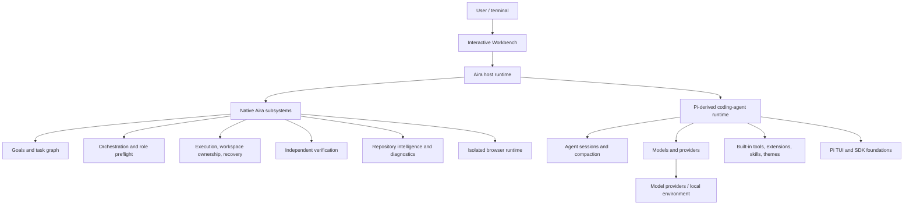

# Aira

Aira is an engineering-focused coding agent built from the [Pi coding-agent](https://github.com/earendil-works/pi) codebase. Pi supplies the underlying agent runtime and ecosystem; Aira adds a host-owned engineering harness and Workbench UI.

The canonical executable is `aira`, and the canonical user home is `~/.aira/`. The package currently retains Pi's package identity, `@earendil-works/pi-coding-agent`, and its `pi` binary alias for compatibility.

## Architecture



Aira-specific code is primarily under [`packages/coding-agent/src/aira/`](packages/coding-agent/src/aira/), with narrow integration points in the Pi-derived host. The native state owner coordinates mode, project, tasks, execution, browser, permissions, and verification state.

## Built-in Aira capabilities

- **Goals**: durable objectives with bounded continuation, progress, usage accounting, completion state, and recovery.
- **Native tasks**: a persisted task graph with dependencies, statuses, child-backed tasks, and session recovery.
- **Orchestration**: child agents, scheduler/event handling, role assignment, bounded per-role budgets, cancellation, and role capability preflight.
- **Modes**: `BUILD`, `PLAN`, and `REVIEW`, cycled with `Shift+Tab`. `PLAN` enforces read-only policy at the host/tool boundary.
- **Agent Inspector**: browse running and recent children and inspect bounded child transcripts and tool activity.
- **Engineering context**: project detection, repository scanning and relationships, live-code/LSP providers, diagnostics, context-cost accounting, and bounded model context.
- **Execution**: managed foreground/background and development processes, tests/builds/checks, PTY-backed interactive processes, status, and output buffering.
- **Browser verification**: a native CDP provider behind a replaceable provider interface. It launches an isolated disposable Chromium profile, exposes observation/navigation/interactions, and records bounded console/network/evidence state.
- **Independent verification**: a fresh, restricted read-only model context evaluates requirements against diagnostics, execution results, browser evidence, and repository changes. Outcomes are `PASS`, `FAIL`, or `INCONCLUSIVE`.
- **Policy and ownership**: project trust, permission presentation/rules, workspace-boundary checks, destructive-repair protection, secret-input boundaries, and owned-process/browser cleanup.
- **Workbench UI**: native Aira shell, mode/status surfaces, task and child views, panels, footer, permissions, and diff/review projections.

## Pi foundation and compatibility

Pi provides the coding-agent runtime, model/provider infrastructure, agent sessions, compaction, built-in tools, SDK/runtime APIs, terminal UI primitives, extension loader, skills, prompt templates, themes, package installation, and the surrounding monorepo packages.

Aira-native behavior lives in the host because modes, state ownership, policy, orchestration, lifecycle, and integrated UI need host-level control. Pi extensions remain supported as an ecosystem boundary: extensions, skills, themes, package syntax, and relevant APIs are preserved where practical. Aira does not claim Pi functionality as Aira-native.

Pi upstream: [github.com/earendil-works/pi](https://github.com/earendil-works/pi) · [pi.dev](https://pi.dev/)

Deeper product and architecture documentation is in [`aira_product_docs/`](aira_product_docs/):

- [`AIRA_ARCHITECTURE.md`](aira_product_docs/AIRA_ARCHITECTURE.md): boundaries, state, modes, and invariants.
- [`DECISIONS.md`](aira_product_docs/DECISIONS.md): accepted architecture decisions and compatibility policy.
- [`ROADMAP.md`](aira_product_docs/ROADMAP.md): planned scope and sequencing.
- [`COMPATIBILITY.md`](aira_product_docs/COMPATIBILITY.md): Pi resources, imports, and compatibility contract.
- [`DEVELOPMENT.md`](aira_product_docs/DEVELOPMENT.md): repository workflow and upstream-sync rules.
- [`UI_BACKLOG.md`](aira_product_docs/UI_BACKLOG.md): deferred Workbench/UI work.

## Install and run

Prerequisites: Node.js `>=22.19.0`.

From a release archive:

1. Download the archive for your platform and CPU from the Aira GitHub release:
   `pi-windows-x64.zip`, `pi-windows-arm64.zip`, `pi-darwin-x64.tar.gz`,
   `pi-darwin-arm64.tar.gz`, `pi-linux-x64.tar.gz`, or
   `pi-linux-arm64.tar.gz`.
2. Extract it to a stable directory, such as an `aira` directory under your
   user programs directory.
3. Add that extracted Aira directory to your `PATH`.
4. Open a new terminal and run:

```text
aira --version
aira
```

On macOS, remove the quarantine attribute from the extracted binary before
running it:

```bash
xattr -dr com.apple.quarantine ~/Applications/aira
```

Replace `~/Applications/aira` with the location of the Aira binary if you
extracted it elsewhere.

The archive is portable and does not require the Earendil Pi npm package or a
separate runtime installation. On Windows, see the [Windows installation guide](packages/coding-agent/docs/windows.md)
for PowerShell commands and shell setup.

The built package exposes both `aira` and `pi`; `aira` is the canonical Aira surface.

## Develop and test

```bash
npm install
npm run check       # formatting, dependency/import checks, type check, browser smoke
./test.sh           # non-LLM repository tests in an isolated home
npm run build       # build all workspaces and the coding-agent bundle
```

The coding-agent package has focused tests with `npm run test --workspace=@earendil-works/pi-coding-agent`. Current source and tests are the implementation record.

## Status and scope

The current code includes native runtime reliability, recovery, ownership, role preflight, bounded budgets, PTY execution, context accounting, and Goal completion.

The following remain deferred or experimental rather than completed product behavior: child steering, transcript persistence, interactive Git rollback, arbitrary panes, passwordless or stored sudo, nested delegation, and empirical budget calibration. The UI backlog also contains future Workbench presentation work. Browser availability is optional; Aira degrades to normal coding behavior when Chromium is unavailable.

## Credits and acknowledgements

Pi receives primary credit. Aira is built from the [Earendil Works Pi source repository](https://github.com/earendil-works/pi), which provides the coding-agent runtime, model/provider and session infrastructure, tools, SDK, TUI, extensions, skills, themes, package system, and monorepo foundations. See also [pi.dev](https://pi.dev/).

The following projects were found in Aira/Pi development history or the read-only reference workspace. They are credited for the relationship shown; historical use does not imply that Aira copied their implementation or depends on them at runtime.

### Installed or used during development

- [`pi-subagents`](https://github.com/nicobailon/pi-subagents) — installed and used as a sub-agent workflow reference; Aira’s orchestration is native and has different isolation and tool-policy boundaries.
- [`narumiruna/pi-extensions`](https://github.com/narumiruna/pi-extensions) — Pi extension collection referenced during development, including the `@narumitw/pi-goal` package.
- [`@narumitw/pi-plan-mode`](https://github.com/narumiruna/pi-extensions) — referenced during early mode exploration.
- [`@narumitw/pi-goal`](https://github.com/narumiruna/pi-extensions) — referenced during early goal exploration; Aira’s Goal Runtime is native.

### Read-only reference specimens

- [`pi-lens`](https://github.com/apmantza/pi-lens) — studied for repository intelligence and freshness ideas; no source was copied and Aira has no runtime dependency on it.
- [`pi-codeontime-code-intelligence`](https://pi.dev/packages/pi-codeontime-code-intelligence) and [`@catdaemon/pi-code-intelligence`](https://github.com/Catdaemon/pi-extensions) — studied for code-intelligence and review behavior; Aira implements its native equivalent.
- [`pi-maestro-flow`](https://www.npmjs.com/package/pi-maestro-flow) and its companion packages `pi-maestro-teammate`, `pi-maestro-backends`, and `pi-maestro-backend-core` — installed in stock Pi and inspected for orchestration and goal-verification behavior.
- [`@crayonlu/qi-harness`](https://github.com/crayonlu/qi-harness) — studied as a goal/runtime reference; Aira deliberately does not depend on it.
- [`pi-browser-harness`](https://github.com/amankumarsingh77/pi-browser-harness) and [`betterwright`](https://github.com/BetterWright/betterwright) — studied for browser-runtime patterns. Aira’s browser subsystem is an independent native CDP implementation behind a provider boundary.
- [`pi-atelier`](https://github.com/michaelmjhhhh/pi-atelier) — studied for Workbench and pane UX. Aira’s Workbench is native and does not load it.
- [`pi-ask-user`](https://github.com/edlsh/pi-ask-user) and [`@d3ara1n/pi-ask-user`](https://github.com/d3ara1n/pi-extensions) — studied for structured interaction; Aira implements its own interaction primitive.
- [`pi-permission-system`](https://github.com/MasuRii/pi-permission-system) and [`pi-agent-permissions`](https://github.com/Mearman/pi-perms) — studied for permission-policy behavior; Aira’s permission controller is host-owned.
- [`@inobit/pi-todo`](https://github.com/inobit/pi-packages) and [`@touchtechclub/pi-oc-todo`](https://github.com/TouchTechClub/pi-toolkit) — studied for task/todo projections; Aira retains one canonical native task graph.

### Development context

These references supplied behavioral and architectural evidence only. In particular, Aira’s native intelligence, orchestration, goals, browser runtime, verification, permissions, and Workbench do not claim substantial source-code reuse from the reference projects. Reference packages are not current Aira dependencies.
